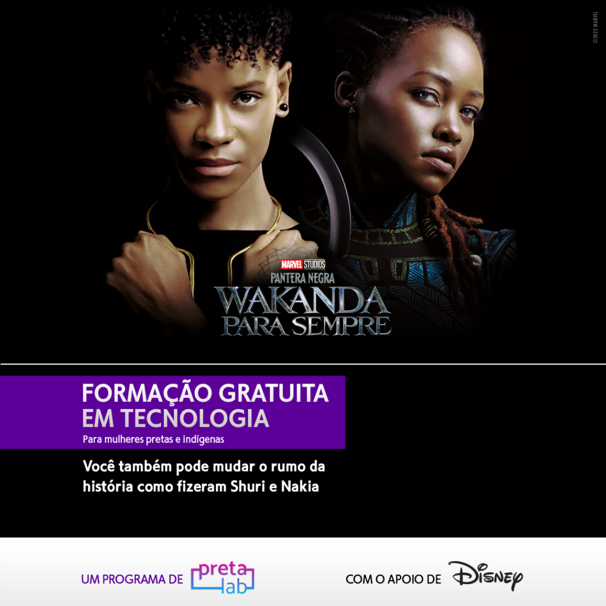

# **Projeto Final**
## **Formação O Poder do Futuro👩🏽‍💻**

---------------------------------------------------
#  **🧾 Índice**
- Layout
    - Cabeçalho
    - Resumo
    - Formações
    - Portifólio
    - Rodapé
- Página Web
- Tecnologias Utilizadas
- Links para Contato

-------------------------------------------

## **💻 Layout**

### Cabeçalho 

Nesse espaço o usuário tem acesso aos tópicos da página e pode acessá-los clicando em cada um deles:

### Resumo  📝

Aqui vai um resumo sobre mim para introduzir minha página:

### Formações 👩🏽‍🎓
Nesse espaço vão minhas formações na área de tecnologia:

### Portifólio 👩🏽‍💻
Aqui coloquei 3 projetinhos que fiz nos cursos de Front-end:

### Rodapé
E no rodapé deixei algumas redes e contatos:

------------------------------------

## **Link da página**
[Clique aqui](https://erika-vieira-projetinho-html.netlify.app/)

---------------------------------------------------------

## **Tecnologias Utilizadas**

1. <a href="https://fonts.google.com/">Google Fonts</a>
2. <a href="https://www.iconsdb.com/white-icons/">White Icons</a>
3. <a href="https://www.netlify.com/">Netlify</a>

----------------------------------------------------------------

## **Meus Links**🔗

[Linkedin](https://www.linkedin.com/in/erika-vieira-dev/)

[Github](https://github.com/erikavieiras)

[Instagram](https://www.instagram.com/oxeerika/)

